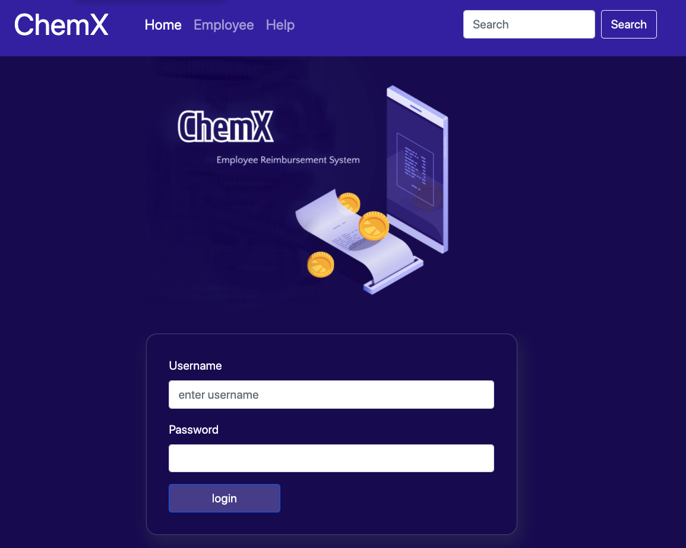
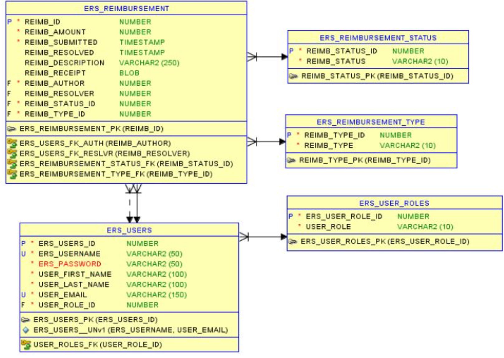

i# ChemX Reimbursement System

## Project Description

A Java project that enables employee profiles to submit reimbursement requests and manager profiles to deny/approve requests. 

## Technologies Used

* Java - version 8
* Tomcat - version 9
* jackson-databind - version 2.11.3
* PostgreSQL - version 42.2.18
* JUnit - version 4.13
* log4j - version 1.2.17
* Bootstrap

## Features

List of features ready and TODOs for future development
* Employee profiles can add a reimbursment request
* Employees can view past requests
* Employees can sort through their request by decision status
* Manager profiles can get a list of all pending requests
* Managers can approve or deny a pending request
* Managers can view all employee request and filter by name, and decision status of request

To-do list:
* Implement fun page not found 
* Add a favicon
* Generate employee queue options to only feed one pending request at time
* Assign pending requests to specific managers
* Implement reciept photo upload
* Implement confirmation emails along the process
* Implement email notifications for pending requests 

## Getting Started
   
1) Clone project to your local computer

2) set up environmental variables:
  TRAINING_DB_URL: [your db connection url]
  TRAINING_DB_CHEMX: [your database name]
  TRAINING_DB_USERNAME: [database username]
  DB_PASSWORD: [database password]

2) Run as project on Tomcat Server at localhost

A successful start up means you'll see this in your browser:

## Usage

You'll need to set up a database with the following constraints.

Once logged in, you should be able to update the JS files with your target url.

You should be able to create, and read from the database. 

